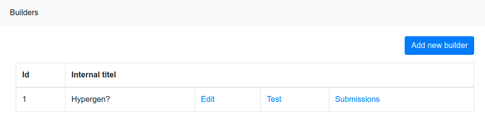
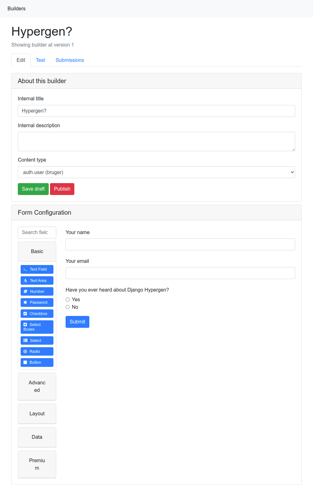
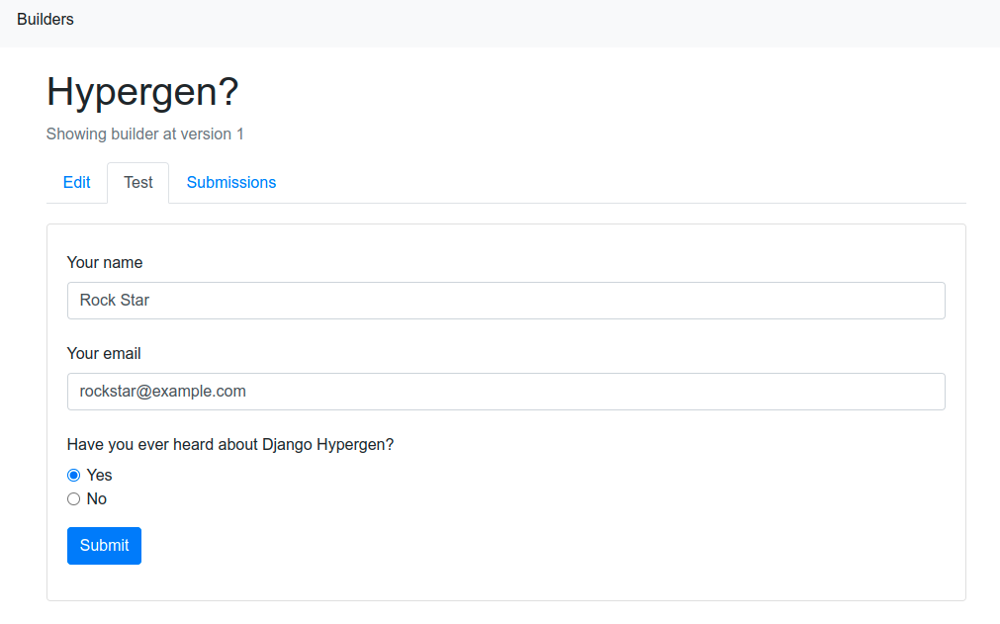

# Django form.io

Build and submit versioned form.io forms from inside Django. Built with `Django Hypergen <hypergen.it>`_

# Screenshots
## List

## Edit and publish

## Test and submit

           
## View submissions

.. image:: screenshots/submissions.png
